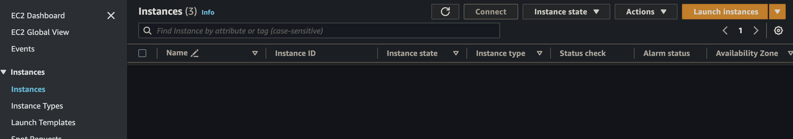
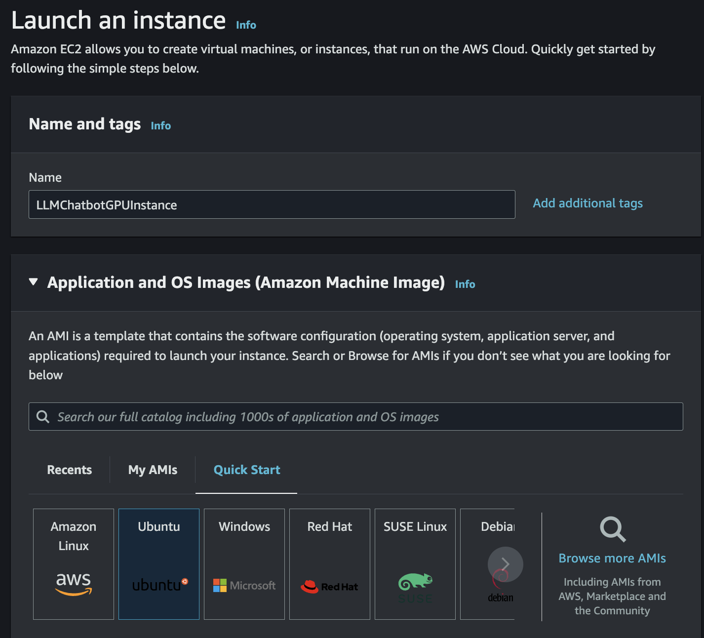
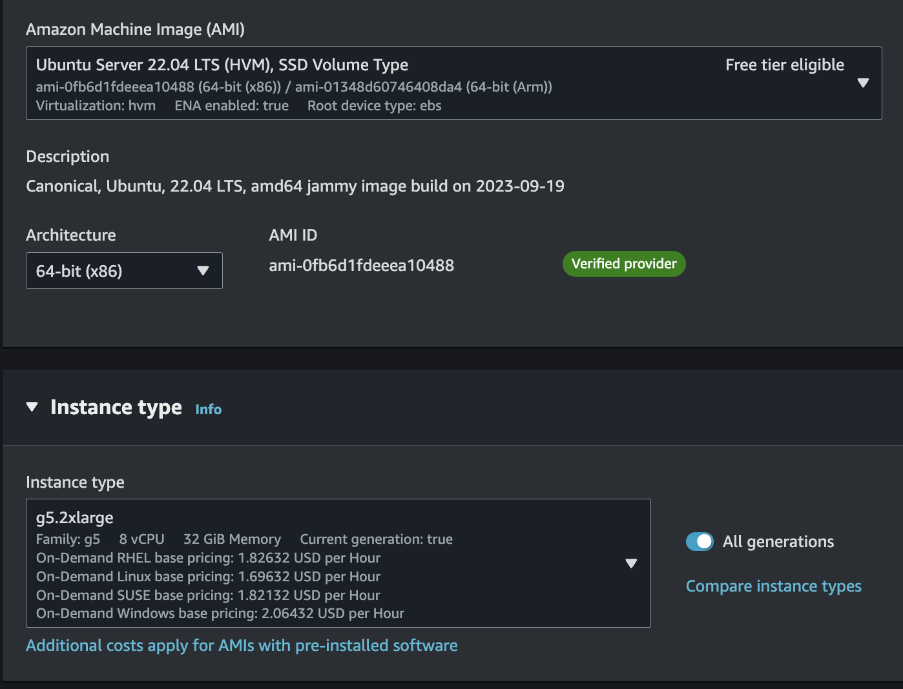
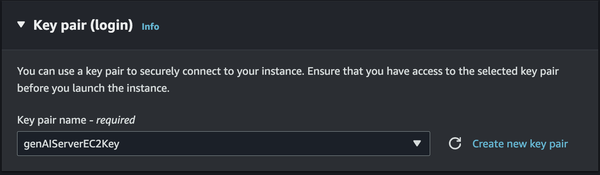
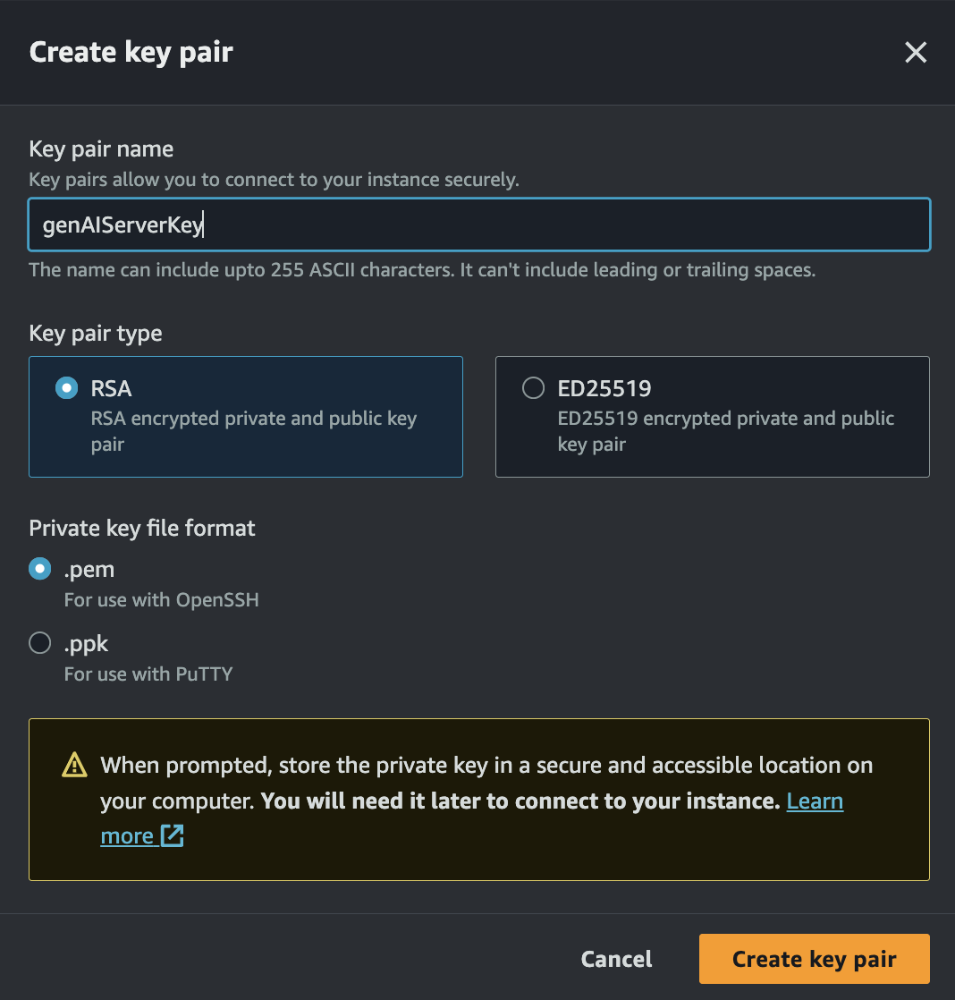
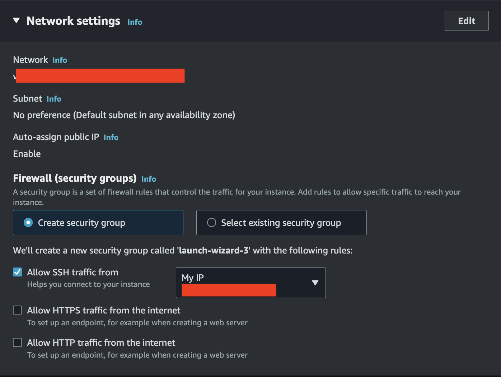
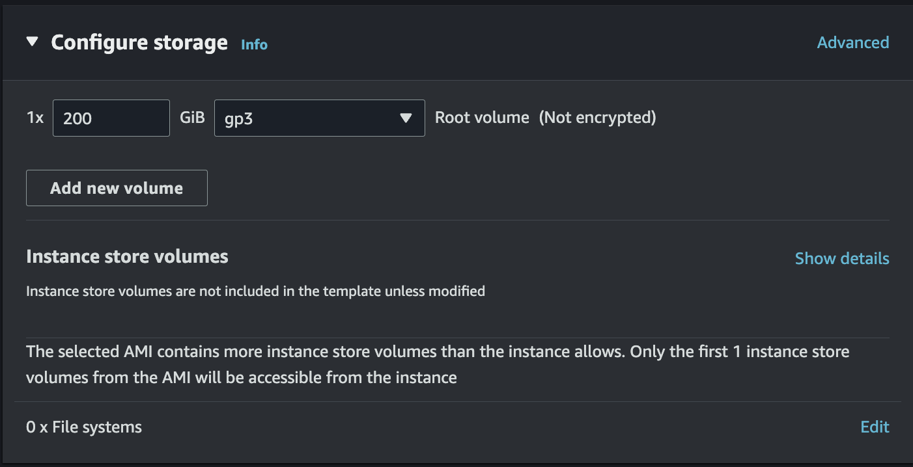
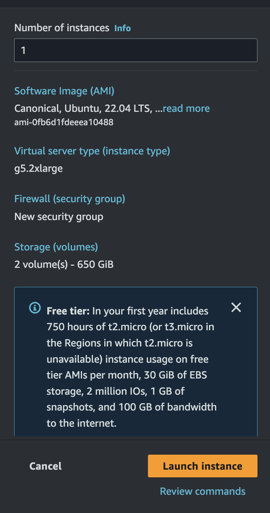
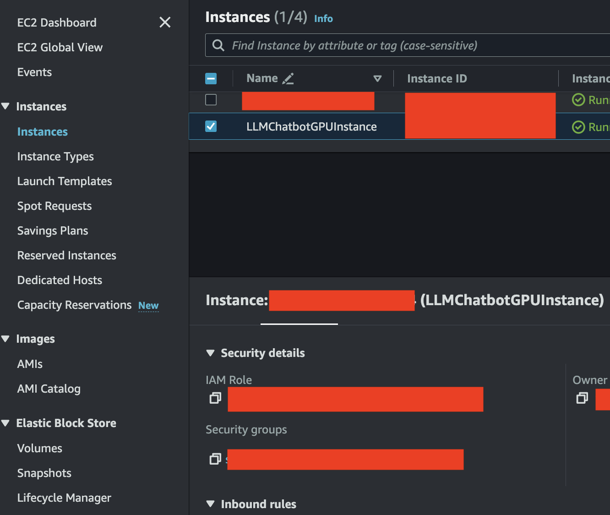

# Guidance on deploying your own LLama2 Chat on EC2 Instance

1. Open Your AWS Console and go to [EC2 Console](https://ap-southeast-3.console.aws.amazon.com/ec2/home?region=ap-southeast-3#Home:)
2. In Right orange button, click `Launch Instances`


3. Fill the name of your server (Example: `LLMChatbotGPUInstance`)
4. Choose the image as `Ubuntu`



5. in <b>Amazon Machine Image<b>, Choose `Ubuntu Server 22.04 LTS (HVM), SSD Volume Type`
6. For your instance type, choose `g5.2xlarge`



7. In Key Pair, choose your key pair. If you don't have it, Click `Create new key pair` (Choose `.pem` for Mac users, and choose `.ppk` for Windows users)





8. In Network Settings, Change the <b>Allow the SSH Traffic from<b> to `My IP`



9. On Configure Storage, Change the Volume to `200`, and using `gp3` Root volume



10. Once it's done, on the right side, Click `Launch Instance`



You are required to wait several minutes before the EC2 instance ready to be used.

While waiting for your EC2 to be ready, let's setup the Security group first.
11. In the `Instances` menu on the left side, Click the checkbox besides your EC2 instance, Click the tab `Security` and click the security group name.



12. Click `Edit inbound rules`
13. Click `Add rule`, and fill the `Custom TCP` with `5173`, and allow your own IP and click `Save rules`.

Once your EC2 is ready, we need to do an SSH connection.

14. For mac users, please open your terminal. This guide will be focusing for mac users. For Windows users, please use any SSH tool that you want. For an example, please check this docs [here](https://docs.aws.amazon.com/AWSEC2/latest/UserGuide/putty.html)
15. In the `Instances` menu on the left side, Click the checkbox besides your EC2 instance, and click "Connect"
16. Click the `SSH Client` tab.

We need to revised a bit on the `Example:` code CLI.

17. Revised it to `ssh -i "<your-PEM-Key-EC2>.pem" -L 5173:localhost:5173 ubuntu@<EC2-Server-Address>`

and enter it on your terminal. If it asked you to keep continue, answer with `yes` and Enter.

If you encounter an issue on the Key, saying `WARNING: UNPROTECTED PRIVATE KEY FILE!`, Please type `chmod 400 <your-PEM-key>.pem`. This is to restrict the access of the key access.

Once you've successfully do the SSH, now this is where it gets real.

18. To update your system on your Ubuntu SSH, type: `sudo apt update && sudo apt upgrade -y``


Keep press `Enter` if anything shows up.

19. Now, install NVIDIA CUDA Driver:
```
wget https://developer.download.nvidia.com/compute/cuda/repos/ubuntu2204/x86_64/cuda-keyring_1.1-1_all.deb
sudo dpkg -i cuda-keyring_1.1-1_all.deb
sudo apt-get update
sudo apt-get -y install cuda
```


NVIDIA CUDA is being used, in order to enable the GPU parallel programming on the GPU core. As g4dn/g5 instance is using NVIDIA behind the scene, we are able to do so. Please refer to this Blog [here for more details](https://blogs.nvidia.com/blog/2012/09/10/what-is-cuda-2/)

20. Install docker:
```
sudo apt install -y apt-transport-https ca-certificates curl software-properties-common
curl -fsSL https://download.docker.com/linux/ubuntu/gpg | sudo apt-key add -
sudo add-apt-repository "deb [arch=amd64] https://download.docker.com/linux/ubuntu $(lsb_release -cs) stable"
sudo apt update
```


21. Install Docker CE: `sudo apt install -y docker-ce`

We need to restart the Server

22. Type `sudo reboot`


The connection will be temporarily shut down for a while. Give 2-5 mins to log back in.

Once it's done, we need to re-log in

23. Type `ssh -i "<your-PEM-Key-EC2>.pem" -L 5173:localhost:5173 ubuntu@<EC2-Server-Address>`

We need to add the user to the docker group, to allow non-root access.

24. Type `sudo usermod -aG docker $USER`

Then, we need to install NVIDIA Container Toolkit

25. (To intall Docker repo and GPG Key) Type
```
distribution=$(. /etc/os-release;echo $ID$VERSION_ID)
curl -s -L https://nvidia.github.io/nvidia-docker/gpgkey | sudo apt-key add -
curl -s -L https://nvidia.github.io/nvidia-docker/$distribution/nvidia-docker.list | sudo tee /etc/apt/sources.list.d/nvidia-docker.list
sudo apt update
```


26. (To install NVIDIA Container Toolkit) Type `sudo apt install -y nvidia-container-toolkit`

27. (Restart Docker) Type `sudo systemctl restart docker`

We need to restart the Server again.

28. Type `sudo reboot`

The connection will be temporarily shut down for a while. Give 2-5 mins to log back in. Once it's done, we need to re-log in

29. Type `ssh -i "<your-PEM-Key-EC2>.pem" -L 5173:localhost:5173 ubuntu@<EC2-Server-Address>`

Now, go to your Hugging Face account, and Create the read access token. You can find it in settings. Copy the Token.

We need to create a script, in order to execute the model from hugging face. This script will make it easier for you to change/replace the model, if necessary.

30. type `vim ModelScript.sh`

31. Copy and paste these configuration to the file. make sure <b>you replace the token</b> with your Hugging face token
```
model=meta-llama/Llama-2-7b-chat-hf
token=<your huggingface token for meta llama repo>
volume=$PWD/data # share a volume with the Docker container to avoid downloading weights every run

docker run -d --gpus all --shm-size 1g -e HUGGING_FACE_HUB_TOKEN=$token -p 8080:80 -v $volume:/data ghcr.io/huggingface/text-generation-inference:1.0.2 --model-id $model --quantize bitsandbytes-nf4 --max-input-length 4000 --max-total-tokens 4096
```

32. Type `:wq` to Write the file, and quit the editor.

You can change the model name, if necessary. 

Now, we need to run the script.

33. (Modify the permission) Type `chmod +x ModelScript.sh`

34. Type `./ModelScript.sh`

Now, we can do the setup for Chatbot UI

35. Clone this repo, by typing
```
git clone https://github.com/huggingface/chat-ui.git
```


36. (Start your MongoDB database) Type
```
docker run -d -p 27017:27017 --name mongo-chatui mongo:latest
```


Now, we need npm. To do so, we need to install nvm first

37. Type
```
curl -o- https://raw.githubusercontent.com/nvm-sh/nvm/v0.39.1/install.sh | bash
```


We need to restart the Server again.

38. Type `sudo reboot`

The connection will be temporarily shut down for a while. Give 2-5 mins to log back in.

Once it's done, we need to re-log in

39. Type `ssh -i "<your-PEM-Key-EC2>.pem" -L 5173:localhost:5173 ubuntu@<EC2-Server-Address>`

Now, we can install nvm

40. Type
```
nvm install node
```


41. Type
```
cd chat-ui
```


42. Type
```
npm install
```


We need to configure the model, to be integrated with the UI.

43. Type
```
vim .env.local
```


44. In the configuration file, type (Don't forget to replace the Hugging face token)
```
MONGODB_URL=mongodb://localhost:27017/
HF_ACCESS_TOKEN=<YOUR TOKEN>
PUBLIC_APP_NAME="LLM Chat"
PUBLIC_APP_ASSETS=chatui
PUBLIC_APP_COLOR=blue

MODELS=`[
{
        "name": "meta-llama/Llama-2-7b-chat-hf",
        "description": "function calling Llama-7B-chat",
        "websiteUrl": "https://ai.meta.com/",
        "userMessageToken": "",
        "userMessageEndToken": " [/INST] ",
        "assistantMessageToken": "",
        "assistantMessageEndToken": " </s><s>[INST] ",
        "chatPromptTemplate": "<s><FUNCTIONS>{functionList}</FUNCTIONS>\n\n[INST] {{#each messages}}{{#ifUser}}{{content}} [/INST]\n\n{{/ifUser}}{{#ifAssistant}}{{content}} </s><s>[INST] {{/ifAssistant}}{{/each}}",
        "parameters": {
                "temperature": 0.2,
                "top_p": 0.95,
                "repetition_penalty": 1.2,
                "top_k": 50,
                "truncate": 1024,
                "max_new_tokens": 1024
        },
        "endpoints": [{
                "url": "http://127.0.0.1:8080"
        }]
}
]`
```


45. Type `:wq` to Write the file, and quit the editor.

We need to configure the `functions.js` file.

46. Inside your chat-ui folder, Type
```
vim functions.js
```


47. Inside functions.js, Type
```
export default {
    "function": "search_bing",
    "description": "Search the web for content on Bing. This allows users to search online/the internet/the web for content.",
    "arguments": [
        {
            "name": "query",
            "type": "string",
            "description": "The search query string"
        }
    ]
}
```


Now, we need to tweak the model configurations.

48. inside your chat-ui folder, Type
```
cd src/lib/server
```


49. Type
```
vim models.ts
```


and Type `i`

This will enable the file to be edited

50. Paste this following code, just above the `cost modelsRaw = ...`
```
import functionList from '../../../functions.js';

console.log("functionList:", functionList);

function escapeSpecialCharacters(value) {
    return value.replace(/[\\]/g, '\\\\')
                .replace(/[\"]/g, '\\"')
                .replace(/[\/]/g, '\\/')
                .replace(/[\b]/g, '\\b')
                .replace(/[\f]/g, '\\f')
                .replace(/[\n]/g, '\\n')
                .replace(/[\r]/g, '\\r')
                .replace(/[\t]/g, '\\t');
}

let stringifiedFunctionList = '';

stringifiedFunctionList += JSON.stringify(functionList, null, 4);

const escapedFunctionList = escapeSpecialCharacters(stringifiedFunctionList);

const modelsString = MODELS.replace('{functionList}', escapedFunctionList);
```


51. Scroll down a bit more, and replace
```
const modelsRaw = z.array(modelConfig).parse(JSON.parse(MODELS));
```


into

```
const modelsRaw = z.array(modelConfig).parse(JSON.parse(modelsString));
```


Now, we can save the file

52. Type escape key, and type `:wq` to modify the file, and quit the editor.

Before we are able to check the App, let's check if the docker containers have already run.

53. Type `docker ps`

If you don't see anything here, it means that your docker container hasn't been started. We need to take the docker ID. If you see 2 containers run, you can skip to step 52.

54. Type
```
docker ps -a
```


You need to start both of the docker containers.

55. Type
```
docker start <docker-id>
```


You have to do it on both mongodb container, and also your model container.

Once you are done, Now, let's test out the app

56. Type
```
npm run dev
```


It will display similar to this page.

57. Open your browser, and enter the link `http://localhost:5173/`

It will display the Chatbot UI.

Let's play it around

58. In the chat, type any questions you want to ask.

Back to [README](../README.md)