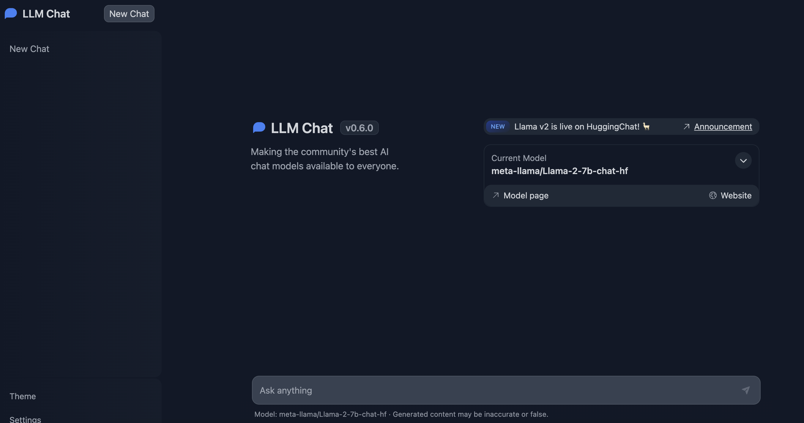

# Deploy your own LLM on AWS EC2 Instance
Deploying Generative AI on top of EC2 Instance, leveraging G5 Instance on CGK (ap-southeast-3/Jakarta) Region

We are going to create a chatbot, deploying the LLM Model (Text-to-Text) to make it more interactive

### Pre-requisite:
1. AWS Account
2. Spin up [EC2 Instance GPU Instance](https://ap-southeast-3.console.aws.amazon.com/console/home?region=ap-southeast-3#) in AWS Console (This case, we are using ap-southeast-3 region)
3. Hugging Face Account, with Read Access Token
4. Access to [Meta-Llama-2-7b-chat-hf Model](https://huggingface.co/meta-llama/Llama-2-7b-chat-hf). To Request, please submit the form to Meta [here](https://ai.meta.com/resources/models-and-libraries/llama-downloads/)

You can also try other public model that you want to play with on hugging face, but make sure you aware about the model configuration

### Spec on EC2:
1. Use g4dn/g5 2xlarge EC2 Instance (You can test using xlarge, or even larger. But to avoid the "Overprovisioning", we advice you to use either xlarge, or 2xlarge.)
2. Root EBS with 200 GB (You can also test with 100 GB if you want, but to avoid storage to run out, we allocated more)

### DISCALIMER:
1. For the cost to run this, it's estimated around ~$ 25 for 2 hours, even can be less, depends on when will you terminate the instance.
2. This demo is using Jakarta Region. Please bear in mind that each of the region might have a different cost

Please refer to guide [here for EC2](./G5%20EC2/EC2Guidance.md)

### References
1. [Text Generation Inference Hugging Face](https://github.com/huggingface/text-generation-inference)
2. [Hugging Face Chat UI](https://github.com/huggingface/chat-ui)

### Special Thanks to
[Trellis Research](https://github.com/TrelisResearch)